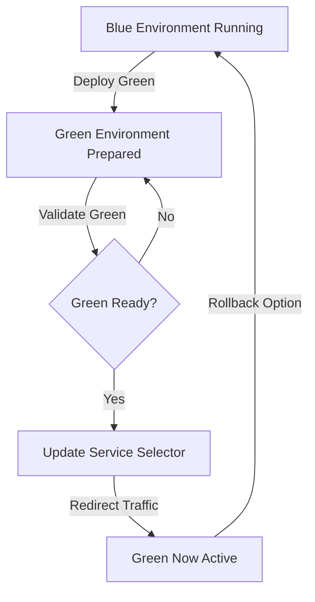

<<<<<<< HEAD
# Blue-Green Deployment Project

## Prerequisites
- Docker Desktop
- Minikube
- kubectl
- Helm
- Node.js
- Git

## Project Setup

### 1. Clone the Repository
```bash
git clone <your-repository-url>
cd blue-green-project
```

### 2. Local Development

#### Backend Setup
1. Navigate to backend directory
2. Install dependencies
```bash
cd backend
npm install
```
3. Create `.env` file with:
```
PORT=5000
MONGO_URI=your-mongodb-connection-string
```
4. Start backend server
```bash
npm start
```

#### Frontend Setup
1. Setup Blue Frontend
```bash
cd frontend-blue
npm install
```
2. Create `.env` file:
```
PORT=3100
```
3. Start blue frontend
```bash
npm start
```

3. Repeat similar steps for Green Frontend (with PORT=3200)

### 3. Dockerization

#### Build Docker Images
```bash
# Build Backend Image
docker build -t your-username/backend:v1 ./backend

# Build Blue Frontend Image
docker build -t your-username/frontend-blue:v1 ./frontend-blue

# Build Green Frontend Image
docker build -t your-username/frontend-green:v1 ./frontend-green
```

### 4. Kubernetes Deployment

#### Minikube Setup
1. Start Minikube
```bash
minikube start
```

2. Enable Required Addons
```bash
minikube addons enable metrics-server
minikube addons enable ingress
```

### 5. Create Kubernetes Manifest Files

#### Required Manifest Files
Create following files in `k8s/` directory:
- `backend-deployment.yaml`
- `frontend-blue-deployment.yaml`
- `frontend-green-deployment.yaml`
- `frontend-service.yaml`
- `ingress.yaml`

#### Service File Key Concepts
Your `frontend-service.yaml` should:
- Use selector to route traffic
- Define version (blue/green)
- Map ports correctly

### 6. Deploy to Minikube
```bash
# Apply all manifests
kubectl apply -f k8s/

# Verify deployments
kubectl get deployments
kubectl get services
kubectl get pods
```

### 7. Blue-Green Switching

#### Switch Traffic Methods

1. Basic Patch Command
```bash
# Switch to Green
kubectl patch service frontend-service -p '{"spec":{"selector":{"version":"green"}}}'

# Switch back to Blue
kubectl patch service frontend-service -p '{"spec":{"selector":{"version":"blue"}}}'
```

2. Detailed Patch Command
```bash
kubectl patch service frontend-service --type='merge' -p '{
  "spec":{
    "selector":{
      "app":"frontend",
      "version":"green"
    }
  }
}'
```

### 8. Verification
- Check service endpoints
- Verify traffic routing
- Monitor application logs

### Troubleshooting
- `kubectl get pods` - Check pod status
- `kubectl logs <pod-name>` - View logs
- `kubectl describe service frontend-service` - Service details

### Cleanup
```bash
# Remove deployments
kubectl delete -f k8s/

# Stop Minikube
minikube stop
```

## Blue-Green Deployment Flow Chart



### Flow Explanation
1. Blue environment is initial production
2. Green environment deployed alongside
3. Validate green environment 
4. Update service selector
5. Redirect traffic to green
6. Blue remains as rollback option

## Best Practices
- Implement health checks
- Use resource limits
- Configure monitoring
- Validate before switching
- Maintain rollback strategy


## License
This project is licensed under the MIT License
=======
# Skill-Test---2-Container-Orchestration

# Container Orchestration Skill Test

## Local Deployment

1. Installed dependencies
2. Started MongoDB
3. Started backend
4. Started both frontends

## Dockerization

Created:

- backend/Dockerfile
- frontend-basic/Dockerfile
- frontend-enhanced/Dockerfile
- docker-compose.yml

Run:

docker-compose up --build

## Kubernetes Deployment

Created:

- mongodb.yaml
- backend.yaml
- frontend-blue.yaml
- frontend-green.yaml
- frontend-service.yaml

Deploy:

kubectl apply -f k8s/

## Blue-Green Deployment Strategy

Blue:
frontend-basic

Green:
frontend-enhanced

Traffic routing controlled by Kubernetes Service selector.

Blue:

version: blue

Green:

version: green

Switch command:

kubectl edit svc frontend

Change:

version: blue

to:

version: green

This allows zero-downtime switching between application versions.

## Challenges

- Docker image visibility in Minikube
- Solved using:

eval $(minikube docker-env)

- Service selector switching for blue-green deployment


Screenshots


>>>>>>> bedda4955f3e6bd6882045ab21515c2b1f7e8b10
